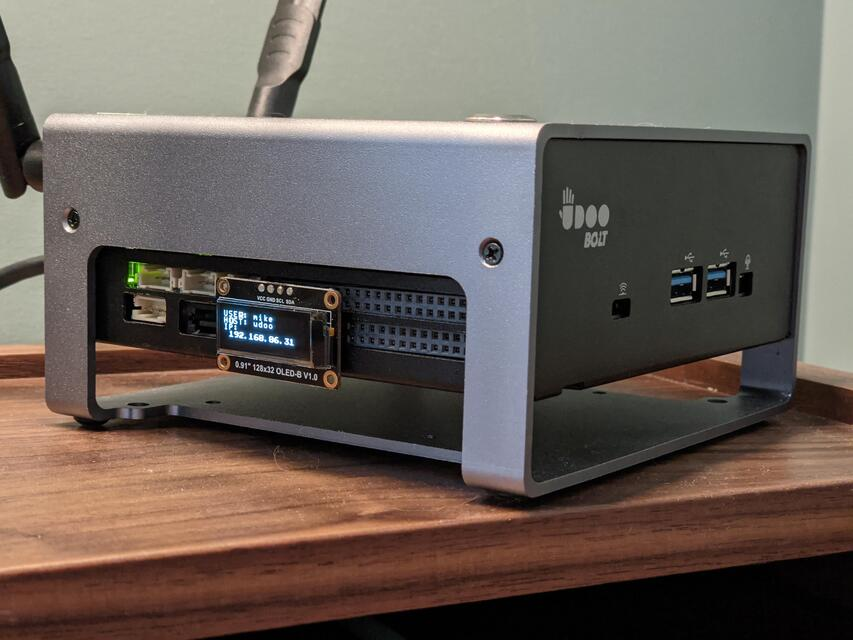

# UDOO Display

Using the embedded atmega32u4 in an [UDOO Bolt Gear](https://www.udoo.org/udooboltgear), display text received over a USB serial interface on an [SSD1306 OLED screen](https://www.dfrobot.com/product-2018.html).

Main application logic and display driver is written in Rust. USB serial implementation uses the [atmega32u4-usb-serial](https://github.com/mogenson/atmega32u4-usb-serial) crate.

Run `cargo make build` to compile and `cargo make flash` to upload.

Write data to serial port to display on the screen. For example: `ip addr | grep -Po '(?<=inet)\s(?!127)[^/]+' > /dev/ttyACM0`, to show the current IP address. Write a null character to clear screen: `echo -ne '\0' > /dev/ttyACM0`.
